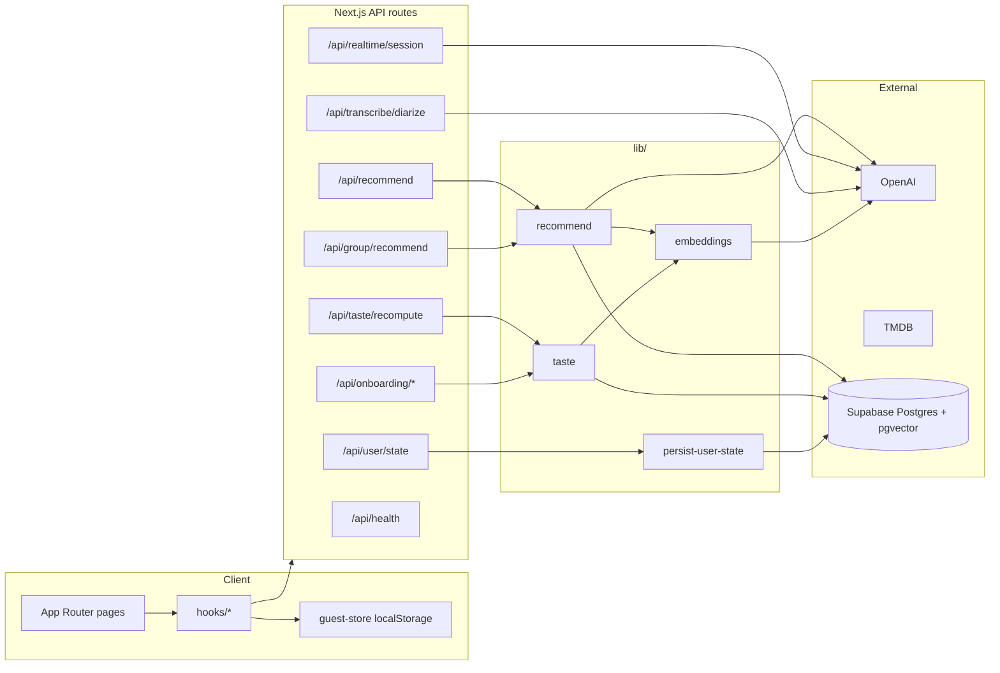
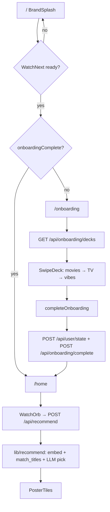
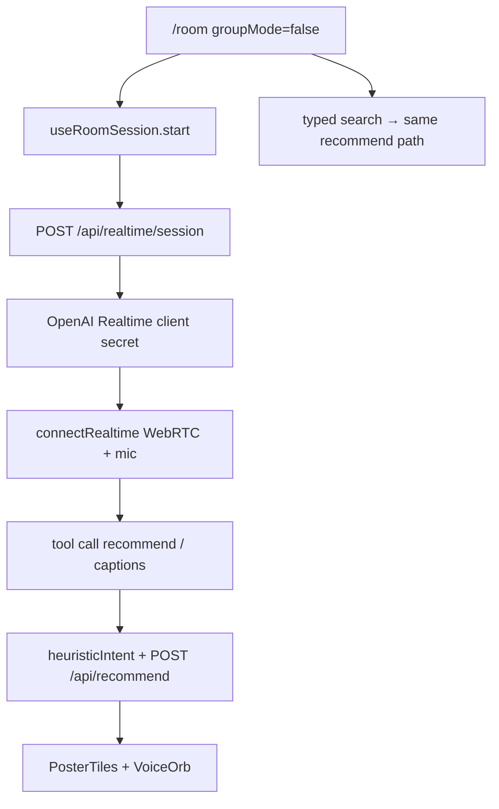
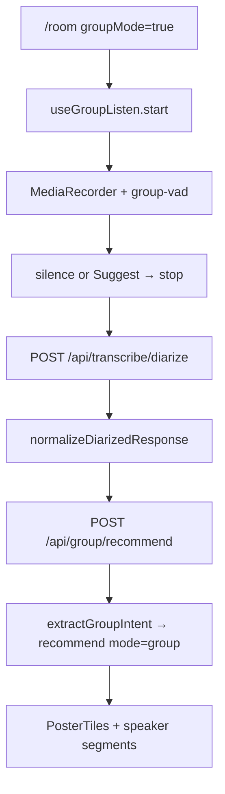
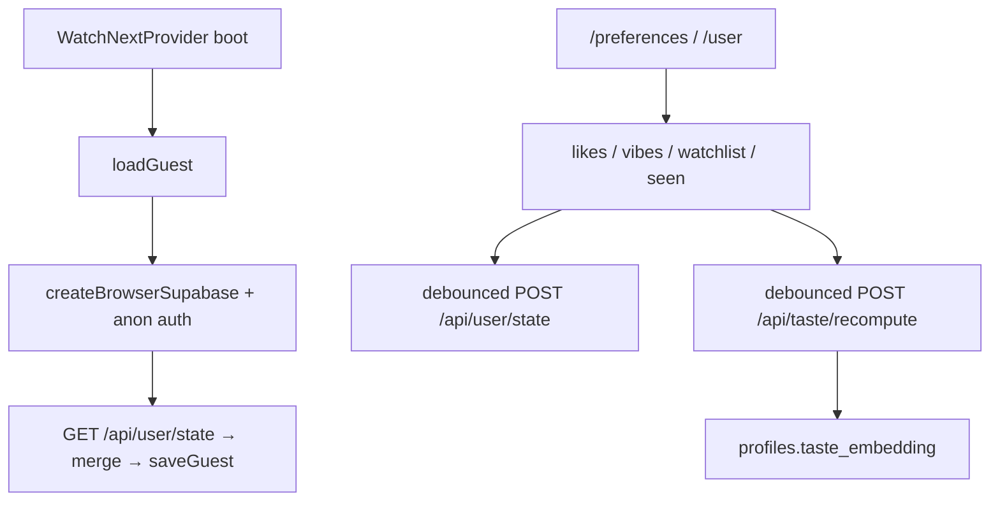
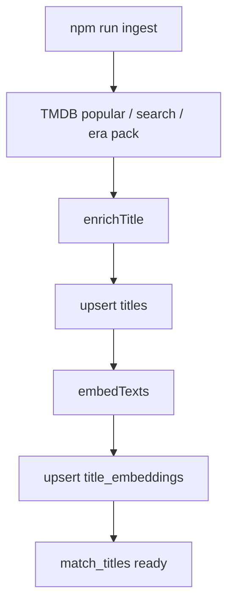

# WatchNext code flow

Living map of how requests move through the app, plus what each significant source file does.

**Keep this file current.** When you add, remove, rename, or rewire routes, API handlers, hooks, `lib/` modules, providers, or flow-owning components, update the diagrams and the matching row in this doc in the same change. Skip `components/ui/*` atoms unless they own a user journey. Do not document secrets or PII.

---

## System overview



---

## User journeys

### Splash → onboarding → home recommend



`(shell)/layout` also wraps shell pages in `RequireOnboarding`, so incomplete guests cannot use Home/Room until decks finish.

### Room live (solo Realtime)



### Room group mode



### Preferences / taste sync



### Catalog ingest (CLI)



---

## Provider stack

```
app/layout.tsx → Providers
├─ ThemeProvider (forced dark)
├─ WatchNextProvider     guest + auth + remote sync
├─ RoomUiProvider        hides shell chrome when room session active
├─ Toaster
├─ PwaRegister
├─ SafeAreaSync
└─ BlockSwipeNavigation
```

---

## Routes

| Route | File | What it does |
| --- | --- | --- |
| `/` | `app/page.tsx` | Splash, then redirect to `/home` or `/onboarding` |
| (root) | `app/layout.tsx` | Fonts, PWA metadata, wraps app in Providers |
| (shell) | `app/(shell)/layout.tsx` | Onboarding gate + AppShell chrome |
| `/home` | `app/(shell)/home/page.tsx` | One-tap taste recommend via WatchOrb |
| `/room` | `app/(shell)/room/page.tsx` | Live Realtime voice, typed search, or Group mode |
| `/preferences` | `app/(shell)/preferences/page.tsx` | Likes, vibes, watchlist, seen, redo onboarding |
| `/user` | `app/(shell)/user/page.tsx` | Display name |
| `/account` | `app/(shell)/account/page.tsx` | Email auth, guest, sign-out, clear local |
| `/onboarding` | `app/onboarding/page.tsx` | Three swipe decks outside the shell |
| — | `app/manifest.ts` | PWA webmanifest |

Bottom tabs (`lib/nav.ts`): `/home`, `/room`. Header menu: preferences, user, account.

---

## API routes

| Route | File | What it does |
| --- | --- | --- |
| `POST /api/recommend` | `app/api/recommend/route.ts` | Solo/shared recommend → `lib/recommend` |
| `POST /api/group/recommend` | `app/api/group/recommend/route.ts` | Group intent extract + `recommend({ mode: "group" })` |
| `POST /api/realtime/session` | `app/api/realtime/session/route.ts` | Mints OpenAI Realtime client secret |
| `GET /api/onboarding/decks` | `app/api/onboarding/decks/route.ts` | Samples movie/TV/vibe decks from catalog or fallbacks |
| `POST /api/onboarding/complete` | `app/api/onboarding/complete/route.ts` | Recomputes taste after onboarding |
| `POST /api/taste/recompute` | `app/api/taste/recompute/route.ts` | Rebuilds `profiles.taste_embedding` |
| `GET/POST /api/user/state` | `app/api/user/state/route.ts` | Load/save likes, vibes, lists, onboarding flag |
| `POST /api/profile` | `app/api/profile/route.ts` | Upserts display name |
| `GET /api/health` | `app/api/health/route.ts` | Env + catalog readiness for the health banner |
| `POST /api/transcribe/diarize` | `app/api/transcribe/diarize/route.ts` | Speaker-labeled STT for Group mode |
| `POST /api/extract` | `app/api/extract/route.ts` | LLM transcript → intent (**unused by UI**; Room uses heuristics) |
| `POST /api/transcribe` | `app/api/transcribe/route.ts` | Batch STT (**no UI caller today**) |
| `POST /api/tts` | `app/api/tts/route.ts` | TTS mp3 (**no callers today**) |

### `recommend()` chain

`lib/recommend.ts` → embed / blend / repel vectors → load taste + likes + seen (admin Supabase) → `rpc("match_titles")` → attach people → OpenAI chat pick → optional TMDB poster.

### `recomputeTaste()` chain

`lib/taste.ts` → upsert profile + likes → mean of liked title embeddings + vibe embeds → write `profiles.taste_embedding`.

---

## Hooks

| File | What it does |
| --- | --- |
| `hooks/use-watchnext.tsx` | Guest localStorage, Supabase anon/session, hydrate/merge/persist, taste refresh, onboarding complete |
| `hooks/use-room-session.ts` | Live Realtime WebRTC; tool/text → `/api/recommend` |
| `hooks/use-group-listen.ts` | Group VAD record → diarize → `/api/group/recommend` |
| `hooks/use-room-ui.tsx` | `active` flag so AppShell can hide chrome |
| `hooks/use-health.ts` | Polls `/api/health` |
| `hooks/use-block-history-back.ts` | Blocks PWA swipe-back / edge back gestures |

---

## Flow-owning components

Skip `components/ui/*` unless a change makes an atom own a journey.

| File | What it does |
| --- | --- |
| `components/providers.tsx` | Theme, WatchNext, Room UI, toaster, PWA, safe-area, back-block |
| `components/app-shell.tsx` | Header, hamburger, tabs; hides chrome when room active |
| `components/require-onboarding.tsx` | Redirects incomplete users out of the shell |
| `components/hamburger-menu.tsx` | Preferences / User / Account links |
| `components/bottom-tabs.tsx` | Home / Room tabs + mobile orb dock host |
| `components/mobile-orb-dock.tsx` | Portals the orb into the tab dock |
| `components/health-banner.tsx` | Surfaces missing keys / empty catalog |
| `components/watch-orb.tsx` | Home recommend trigger |
| `components/voice-orb.tsx` | Room session state orb |
| `components/poster-tiles.tsx` | Recommendation poster rail/grid |
| `components/title-detail.tsx` | Title detail surface |
| `components/title-actions.tsx` | Like / watchlist / seen → WatchNext state |
| `components/swipe-deck.tsx` | Onboarding swipe cards |
| `components/brand-logo.tsx` | Logo + BrandSplash |
| `components/pwa-register.tsx` | Registers `/sw.js` in production |
| `components/safe-area-sync.tsx` | Sets `--wn-safe-top/bottom` CSS vars |

---

## `lib/` modules

| File | What it does |
| --- | --- |
| `lib/types.ts` | Shared domain types (`GuestState`, recommend input, intents, health) |
| `lib/env.ts` | Server secrets + aliases (`requireOpenAI`, TMDB, Supabase admin) |
| `lib/public-env.ts` | Client-safe Supabase URL / publishable flags |
| `lib/openai.ts` | OpenAI client + model name constants |
| `lib/errors.ts` | Route error JSON helpers |
| `lib/config-error.ts` | Typed config failures (e.g. empty catalog) |
| `lib/recommend.ts` | Core retrieval + LLM pick |
| `lib/embeddings.ts` | Embed text + vector blend/repel + title embed text |
| `lib/taste.ts` | Persist taste embedding from likes/vibes |
| `lib/extract.ts` | Solo LLM intent extract (API exists; UI prefers heuristics) |
| `lib/group-extract.ts` | Group compromise intent |
| `lib/intent-heuristic.ts` | Fast client/server intent heuristics + auto-suggest |
| `lib/diarize.ts` | Normalize diarized segments / speaker labels |
| `lib/group-vad.ts` | Group silence/speech VAD tick + constants |
| `lib/guest-store.ts` | localStorage guest state (`watchnext-guest-v1`) |
| `lib/user-state.ts` | Merge helpers + client fetch/save remote state |
| `lib/persist-user-state.ts` | Server load/save lists in Postgres |
| `lib/tmdb.ts` | TMDB HTTP, enrichment, onboarding pool |
| `lib/onboarding-catalog.ts` | Fallback decks, vibe cards, deck sampling |
| `lib/realtime-session.ts` | Realtime session + tool config |
| `lib/realtime-webrtc.ts` | Browser WebRTC connect to OpenAI Realtime |
| `lib/realtime-constants.ts` | Recommend tool name constant |
| `lib/microphone.ts` | `getUserMedia` + block-reason helpers |
| `lib/supabase/admin.ts` | Service/anon admin client for server mutations/search |
| `lib/supabase/client.ts` | Browser auth client |
| `lib/supabase/server.ts` | Cookie-less server client (**unused today**) |
| `lib/supabase/timeout.ts` | Hosted vs local fetch timeouts / hints |
| `lib/with-timeout.ts` | Promise timeout wrapper |
| `lib/timed-fetch.ts` | Abortable / timed fetch helpers |
| `lib/poster.ts` | TMDB poster/backdrop URLs |
| `lib/pwa.ts` | PWA constants + Apple splash media |
| `lib/app-origin.ts` | `metadataBase` origin |
| `lib/nav.ts` | Bottom/desktop tab definitions |
| `lib/button-styles.ts` | Shared primary action class |
| `lib/utils.ts` | `cn` className helper |
| `lib/speech-recognition.ts` | Web Speech wrapper (**no importers**) |
| `lib/wav.ts` | PCM → WAV (**no importers**) |
| `lib/transcribe-client.ts` | Client helper for `/api/transcribe` (**no UI importers**) |

---

## Scripts and data

| File | What it does |
| --- | --- |
| `scripts/ingest-tmdb.ts` | CLI: TMDB → upsert titles + embeddings |
| `scripts/era-pack.ts` | Named era/title query pack for ingest `--pack era` |
| `scripts/generate-icons.mjs` | Regenerates favicon / PWA / Apple / OG images |
| `scripts/verify-ui.mjs` | Playwright smoke against local app |
| `supabase/migrations/20240919170000_init.sql` | Core schema, `match_titles`, RLS, auth trigger |
| `supabase/migrations/20260920023857_add_directors_creators.sql` | Directors/creators + updated `match_titles` |
| `supabase/seed.sql` | Seed data |
| `supabase/config.toml` | Local Supabase config (anon sign-ins enabled) |
| `public/sw.js` | Service worker registered in production |

---

## Data layer

| Layer | Mechanism |
| --- | --- |
| Local | `lib/guest-store.ts` → `watchnext-guest-v1` |
| Browser auth | `createBrowserSupabase` — anonymous sign-in when enabled |
| Remote lists | `GET/POST /api/user/state` → `profiles`, `user_likes`, `user_watchlist`, `user_seen` |
| Taste vector | `profiles.taste_embedding` via `recomputeTaste` |
| Catalog | `titles` + `title_embeddings`; search via `match_titles` |
| Clients | Browser client is mainly **auth**; recommend/taste/persist use **admin** |

---

## Behavioral notes

1. **Home** recommend is query-light (“pick something”) blended with taste (~55% query / ~45% taste).
2. **Room live** uses Realtime tool args + `heuristicIntent`, not `/api/extract`.
3. **Group** blends discussion heavier (`mode: "group"`, ~85% discussion weight).
4. **Onboarding complete** writes lists then taste; later preference edits debounce-recompute taste.
5. **Shell chrome** hides while `RoomUi.active` (live or group session).
6. Empty catalog → `ConfigError EMPTY_CATALOG` pointing at `npm run ingest`.

---

## Maintenance checklist (agents)

When code changes, update this doc if any of these are true:

- [ ] New/removed/renamed route under `app/` (pages or `api/`)
- [ ] New/removed hook or provider wiring
- [ ] New/removed `lib/` module, or a call graph change between API → lib → external
- [ ] New flow-owning component (not a pure `ui/` atom)
- [ ] Ingest, migration, or data-table ownership change
- [ ] A previously orphaned API/lib becomes used (or the reverse) — flip the “unused” note

Update the affected mermaid journey(s) and the matching table row(s). Prefer editing existing sections over adding parallel docs.
